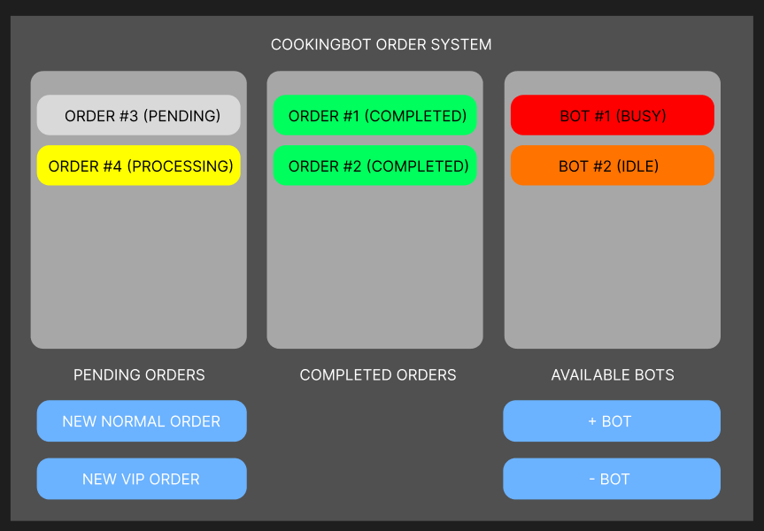

## CookingBot Order System
Link: https://vyvienne.github.io/se-take-home-assignment

  
  
  

### Features
- **Add New Normal Order** -> Creates a new order in the Pending area.  
- **Add New VIP Order** -> Creates a VIP order that is prioritized ahead of normal orders.  
- **Cooking Bots**  
  - Add a bot to automatically process pending orders.  
  - Bots move orders from Pending to Completed after 10 seconds.  
  - Idle bots wait for new orders when none are available.  
- **Manage Bots**  
  - Add multiple bots to process orders in parallel.  
  - Remove the newest bot, but if it was processing, the order goes back to Pending.  

### Navigation and Guide
  

1. This is the area that shows all pending and processing orders. 
2. This is the area that shows all pending and completed orders.
3. This is the area that shows all available bots.
4. This button will add a new normal order to the processing orders area.
5. This button will add a new vip order to the processing orders area.
6. This button will add a new bot.
7. This button will remove an existing bot.

 
 

### Diagrams and Screenshots

**Class Diagram (draw.io)**  
 
  
*The relationship between orders, bots, and system*
[View Class Diagram on draw.io](https://drive.google.com/file/d/12zSYeIzdkkMp3QczAnlS6P3vISCX_QhL/view?usp=drive_link)

 

**UI Design (Figma)**  
 
  
*This is the initial UI mockup*
[View UI Design on Figma](https://www.figma.com/design/nme8PYrXDRU8C6xlA7H4EL/FeedMe?node-id=0-1&t=zVPh4efur1SM4amj-1)

---

### Future improvements
1) A button to clear all available bots instead of deleting them 1 by 1
   - Reason: when there are too many available bots, and the manager want to clear all of them, he/she had no choice but to keep spamming the '- bot' button
   - Approach: call destroy() for each of the available bots

2) A button to clear all completed orders
   - Reason: the completed order will keep stacking as there are more and more orders coming in, have to scroll through all of the records to get the information of the recently added records
   - Approach: filter out all completed orders

3) A button to allow/disallow orders to come in
   - Reason: when the store is closed, it should not take in any orders
   - Approach: hide or disable the new order buttons

4) A button to clear the selected pending order
   - Reason: the customer might clicked on the add order accidentally but there is no remove order function
   - Approach: get the index of the selected order by passing in the orderid and remove the order

5) A button to move the order to top
   - Reason: when the normal customer do not have patience to wait until all of the vip orders to be done, the button can push the normal customer's order to top
   - Approach: get the index of the selected order by passing in the orderid and move the order to top

6) Add the completed datetime for the order
   - Reason: the manager do not have record on when is the order getting complete
   - Approach: pass in the completed datetime when the order is completed

7) Integrate authentication and authorization
   - Reason: the customers (both vip and customer) should not allowed to add/delete bot and can only add orders (based on customer type)
   - Approach: add auth for vip customer, normal customer and manager using json web token
