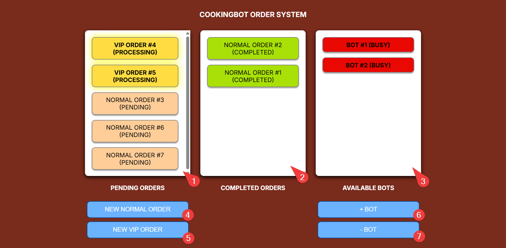

## CookingBot Order System
Link: https://vyvienne.github.io/se-take-home-assignment

  
  
  

### Features
- **Add New Normal Order** -> Creates a new order in the Pending area.  
- **Add New VIP Order** -> Creates a VIP order that is prioritized ahead of normal orders.  
- **Cooking Bots**  
  - Add a bot to automatically process pending orders.  
  - Bots move orders from Pending to Completed after 10 seconds.  
  - Idle bots wait for new orders when none are available.  
- **Manage Bots**  
  - Add multiple bots to process orders in parallel.  
  - Remove the newest bot, but if it was processing, the order goes back to Pending.  

### Interface Overview
  

1. This is the area that shows all pending and processing orders. 
2. This is the area that shows all pending and completed orders.
3. This is the area that shows all available bots.
4. This button will add a new normal order to the processing orders area.
5. This button will add a new vip order to the processing orders area.
6. This button will add a new bot.
7. This button will remove an existing bot.

 
 

### Diagrams and Screenshots

**McDonald Color Palette**  
 
  
*The color palette for the target customer, McDonald's*
[Source](https://www.schemecolor.com/mcdonalds-burger-color-palette.php)

 

**UI Design (Figma)**  
 
  
*This is the initial UI mockup*
 
  
*This is the refined UI design after applying McDonald's color palette*
 
[View UI Design on Figma](https://www.figma.com/design/nme8PYrXDRU8C6xlA7H4EL/FeedMe?node-id=0-1&t=zVPh4efur1SM4amj-1)

**Class Diagram (draw.io)**  
 
  
*The relationship between orders, bots, and system*
[View Class Diagram on draw.io](https://drive.google.com/file/d/12zSYeIzdkkMp3QczAnlS6P3vISCX_QhL/view?usp=drive_link)

 

---

### Future improvements
1) A button to clear all available bots instead of deleting them 1 by 1
   - Reason: when there are too many available bots, and the manager want to clear all of them, he/she had no choice but to keep spamming the '- bot' button
   - Approach: call destroy() for each of the available bots

2) A button to clear all completed orders
   - Reason: the completed order will keep stacking as there are more and more orders coming in, have to scroll through all of the records to get the information of the recently added records
   - Approach: filter out all completed orders

3) A button to allow/disallow orders to come in
   - Reason: when the store is closed, it should not take in any orders
   - Approach: hide or disable the new order buttons

4) A button to clear the selected pending order
   - Reason: the customer might clicked on the add order accidentally but there is no remove order function
   - Approach: get the index of the selected order by passing in the orderid and remove the order

5) A button to move the order to top
   - Reason: when the normal customer do not have patience to wait until all of the vip orders to be done, the button can push the normal customer's order to top
   - Approach: get the index of the selected order by passing in the orderid and move the order to top

6) Add the completed datetime for the order
   - Reason: the manager do not have record on when is the order getting complete
   - Approach: pass in the completed datetime when the order is completed

7) Integrate authentication and authorization
   - Reason: the customers (both vip and customer) should not allowed to add/delete bot and can only add orders (based on customer type)
   - Approach: add auth for vip customer, normal customer and manager using json web token

---

## FeedMe Software Engineer Take Home Assignment
Below is a take home assignment before the interview of the position. You are required to
1. Understand the situation and use case. You may contact the interviewer for further clarification.
2. Fork this repo and implement the requirement with your most familiar tools.
3. Complete the requirement and perform your own testing.
4. Provide documentation for the any part that you think is needed.
5. Commit into your own github and share your repo with the interviewer.
6. Bring the source code and functioning prototype to the interview session.

### Situation
McDonald is transforming their business during COVID-19. They wish to build the automated cooking bots to reduce workforce and increase their efficiency. As one of the software engineer in the project. You task is to create an order controller which handle the order control flow. 

### User Story
As below is part of the user story:
1. As McDonald's normal customer, after I submitted my order, I wish to see my order flow into "PENDING" area. After the cooking bot process my order, I want to see it flow into to "COMPLETE" area.
2. As McDonald's VIP member, after I submitted my order, I want my order being process first before all order by normal customer.  However if there's existing order from VIP member, my order should queue behind his/her order.
3. As McDonald's manager, I want to increase or decrease number of cooking bot available in my restaurant. When I increase a bot, it should immediately process any pending order. When I decrease a bot, the processing order should remain un-process.
4. As McDonald bot, it can only pickup and process 1 order at a time, each order required 10 seconds to complete process.

### Requirements
1. When "New Normal Order" clicked, a new order should show up "PENDING" Area.
2. When "New VIP Order" clicked, a new order should show up in "PENDING" Area. It should place in-front of all existing "Normal" order but behind of all existing "VIP" order.
3. The order number should be unique and increasing.
4. When "+ Bot" clicked, a bot should be created and start processing the order inside "PENDING" area. after 10 seconds picking up the order, the order should move to "COMPLETE" area. Then the bot should start processing another order if there is any left in "PENDING" area.
5. If there is no more order in the "PENDING" area, the bot should become IDLE until a new order come in.
6. When "- Bot" clicked, the newest bot should be destroyed. If the bot is processing an order, it should also stop the process. The order now back to "PENDING" and ready to process by other bot.
7. No data persistance is needed for this prototype, you may perform all the process inside memory.

### Functioning Prototype
You may demostrate your final funtioning prototype with **one and only one** of the following method:
- CLI application
- UI application
- E2E test case

### Tips on completing this task
- Testing, testing and testing. Make sure the prototype is functioning and meeting all the requirements.
- Do not over engineering. Try to scope your working hour within 3 hours (1 hour per day). You may document all the optimization or technology concern that you think good to bring in the solution.
- Complete the implementation as clean as possible, clean code is a strong plus point, do not bring in all the fancy tech stuff.